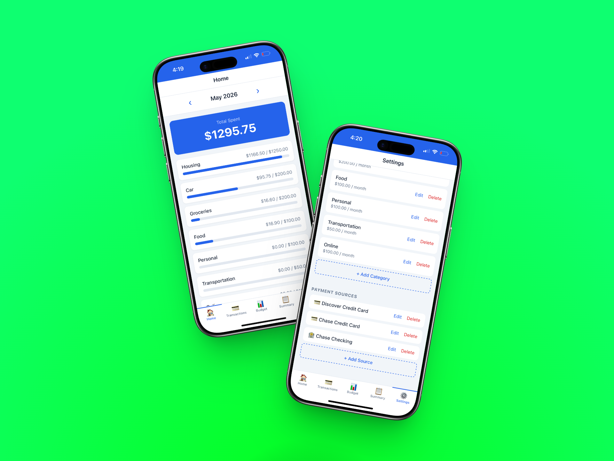

# Expensior
>>>>>>> 57b0454 (repo: Renamed app to Expensior)

A personal expense tracker built as a PWA. Track monthly expenses by category and payment source, set budget limits, and view spending summaries — all from your phone, no app store needed.

## Features

- Add expenses with a note, amount, category, and payment source
- Dynamic categories with monthly budget limits
- Track spending via Discover, Chase, or Bank ACH
- Monthly view — switch between months to see historical data
- Summary dashboard: spend per category, per source, remaining budgets
- Fully offline-capable, data stored locally in your browser

## Stack

- React + Vite
- PWA (installable on iPhone/Android via "Add to Home Screen")
- Built with [Claude Code](https://claude.ai/code)

## Live App

[spendyn.pages.dev](https://spendyn.pages.dev)
